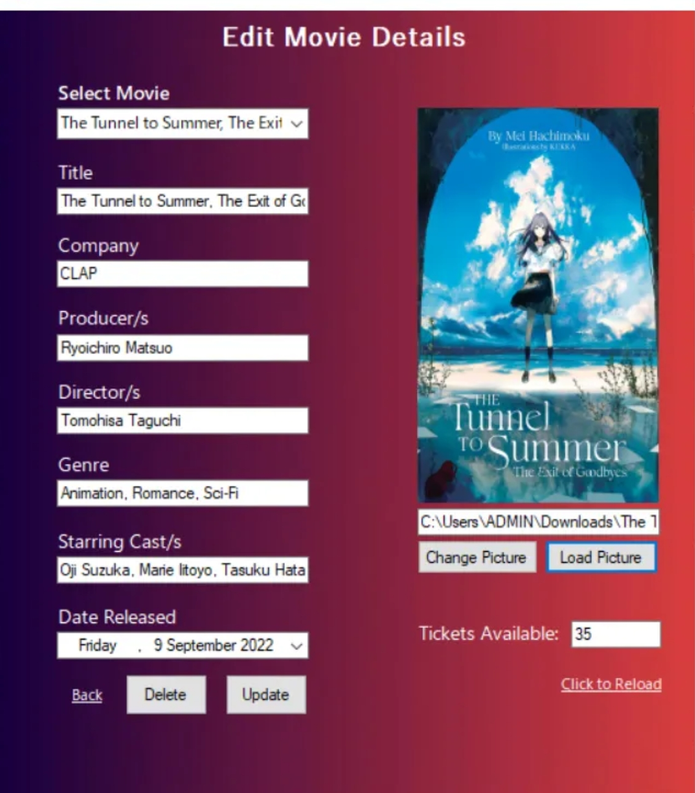

# Cinema Booking System

## Project Description

The Cinema Booking System is a desktop application developed in VB.NET. It allows users to browse movies, select showtimes, choose seats, and make bookings. The system is designed to provide a seamless and user-friendly experience for movie-goers.

## Table of Contents

- [Features](#features)
- [Usage](#usage)
- [Screenshots](#screenshots)
- [Technologies Used](#technologies-used)

## Features

- **User Authentication**: Login and registration system.
- **Movie Listings**: Browse current and upcoming movies.
- **Showtime Selection**: View available showtimes for selected movies.
- **Booking Confirmation**: Confirm bookings with details and ticket/receipt generator.
- **Admin Panel**: Manage movies, showtimes, and users.

## Screenshots

### Login Page

### Movie Editing Page (ADMIN)

### Sample Receipt

## Technologies Used

- **VB.NET**: Main programming language.
- **Windows Form**: UI framework.
- **MariaDB | SQL Server**: Database.
  
